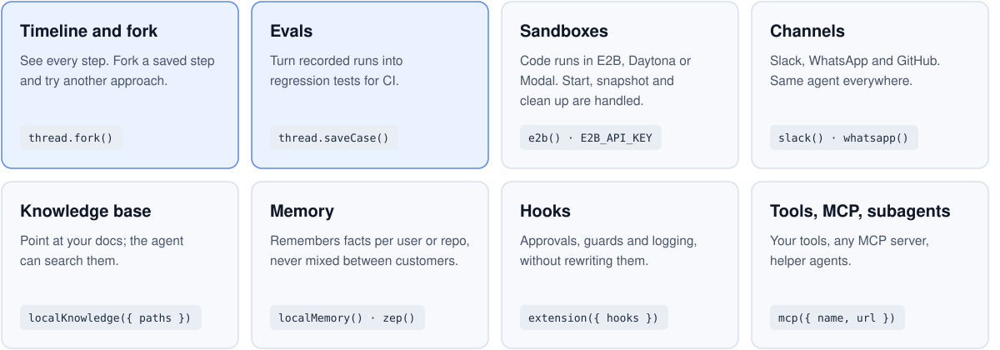

<div align="center">
  <h1>threads</h1>
  <h3>Stop rebuilding the same agent plumbing.</h3>
  <a href="https://github.com/useagenthq/threads/actions/workflows/typescript.yml"></a>
  <a href="https://github.com/useagenthq/threads/actions/workflows/python.yml"></a>
  <a href="LICENSE"></a>
  
</div>

<br>

Every team building agents writes the same pieces again: a sandbox, a Slack bot, a WhatsApp bot, hooks, a knowledge base, memory, evals. threads ships them built in, for **TypeScript and Python**. You write what your agent does and add your API keys.

> [!NOTE]
> Alpha: not on npm or PyPI yet, and APIs may change. [Install from source](#install-from-source) to try it.

## What's built in

<picture>
  <source media="(prefers-color-scheme: dark)" srcset=".github/assets/features-dark.svg">
  
</picture>

Also built in: permissions and approvals, skills loaded on demand, handoffs and teams, and tools for shell, files, search, web, git, code intelligence, notebooks and computer use.

## What it looks like

```ts
import { agent, tool } from "@threads/core";
import { anthropic } from "@threads/anthropic";
import { e2b } from "@threads/e2b";
import { z } from "zod";

const openPullRequest = tool({
  name: "open_pull_request",
  description: "Open a pull request with the fix.",
  input: z.object({ title: z.string(), branch: z.string() }),
  runs: "host",
  execute: async ({ title, branch }) => myForge.openPr(title, branch), // myForge: your own code
});

const fixer = agent({
  name: "fixer",
  instructions: "Fix failing CI and open a pull request.",
  model: anthropic({                // ANTHROPIC_API_KEY
    model: "claude-sonnet-5",
    maxTokens: 8192,
    contextWindow: 200_000,
    maxOutputTokens: 8192,
  }),
  sandbox: e2b(),                   // E2B_API_KEY
  tools: [openPullRequest],
});

const result = await fixer.run("CI is failing on main");
```

```python
from pydantic import BaseModel
from threads import agent, tool
from threads.anthropic import anthropic
from threads.e2b import e2b

class PrInput(BaseModel):
    title: str
    branch: str

async def open_pr(args: PrInput, ctx) -> str:
    return await my_forge.open_pr(args.title, args.branch)  # my_forge: your own code

open_pull_request = tool(
    name="open_pull_request",
    description="Open a pull request with the fix.",
    input=PrInput,
    runs="host",
    execute=open_pr,
)

fixer = agent(
    name="fixer",
    instructions="Fix failing CI and open a pull request.",
    model=anthropic(                  # ANTHROPIC_API_KEY
        "claude-sonnet-5",
        context_window=200_000,
        max_output_tokens=8192,
    ),
    sandbox=e2b(),                    # E2B_API_KEY
    tools=[open_pull_request],
)

result = await fixer.run("CI is failing on main")
```

The core is a plain library: no server needed. Channels, schedules and the HTTP API run in the optional host (`threads dev`).

## Providers

| | TypeScript | Python |
|---|---|---|
| Models | Anthropic, OpenAI, AI SDK bridge | Anthropic, OpenAI, LiteLLM (`openai/` route) |
| Sandboxes | E2B (Bun), Daytona | E2B, Daytona, Modal |
| Channels | Slack, WhatsApp, GitHub | Slack, WhatsApp, GitHub |
| Memory | local, Supermemory, Zep | local, Supermemory, Zep |


Each provider is one line. Keys come from your environment unless you pass them.

### Sandboxes

```ts
import { e2b } from "@threads/e2b";
import { daytona } from "@threads/daytona";

sandbox: e2b({ template: "base" }),                          // E2B_API_KEY (runs on Bun)
sandbox: daytona({ apiKey: process.env["DAYTONA_API_KEY"] ?? "" }),
// Modal: Python only for now (its JS SDK's transport can't be fenced yet)
```

```python
from threads.daytona import daytona
from threads.e2b import e2b
from threads.modal import modal

sandbox=e2b(template="base")         # E2B_API_KEY
sandbox=daytona()                    # DAYTONA_API_KEY
sandbox=modal(image_id="im-...")     # MODAL_TOKEN_ID, MODAL_TOKEN_SECRET
```

Sandboxes have no internet by default; pass `internet: true` (TS e2b), `network: "open"` (TS daytona) or `allow_internet=True` (Python) to open it.

### Models

```ts
import { anthropic } from "@threads/anthropic";
import { openai } from "@threads/openai";
import { aiSdk } from "@threads/ai-sdk";

model: anthropic({ model: "claude-sonnet-5", maxTokens: 8192, contextWindow: 200_000, maxOutputTokens: 8192 }), // ANTHROPIC_API_KEY
model: openai({ model: "gpt-5.5", contextWindow: 400_000, maxOutputTokens: 8192 }),                              // OPENAI_API_KEY
model: aiSdk({ model: (fetch) => yourProvider({ fetch })("model-id"), contextWindow: 128_000, maxOutputTokens: 8192 }), // any AI SDK provider
```

```python
from threads.anthropic import anthropic
from threads.litellm import litellm
from threads.openai import openai

model=anthropic("claude-sonnet-5", context_window=200_000, max_output_tokens=8192)  # ANTHROPIC_API_KEY
model=openai("gpt-5.5", context_window=400_000, max_output_tokens=8192)             # OPENAI_API_KEY
model=litellm("openai/my-model", base_url="http://localhost:4000", context_window=128_000, max_output_tokens=8192)
```

### Channels

Channels run in the optional host. Start it with `threads dev`; it prints each channel's webhook URL.

```ts
import { secret, sqlite } from "@threads/core";
import { host } from "@threads/host";
import { slack } from "@threads/slack";
import { whatsapp } from "@threads/whatsapp";
import { github } from "@threads/github";

export default host({
  store: sqlite(".threads"),
  agents: { fixer },
  channels: {
    slack: slack({ agent: "fixer", signingSecret: secret("SLACK_SIGNING_SECRET"), botToken: secret("SLACK_BOT_TOKEN") }),
    whatsapp: whatsapp({ agent: "fixer", appSecret: secret("WHATSAPP_APP_SECRET"), accessToken: secret("WHATSAPP_ACCESS_TOKEN") }),
    github: github({ agent: "fixer", webhookSecret: secret("GITHUB_WEBHOOK_SECRET"), token: secret("GITHUB_TOKEN") }),
  },
});
```

```python
from threads import secret, sqlite
from threads.github import github
from threads.host import host
from threads.slack import slack
from threads.whatsapp import whatsapp

app = host(
    store=sqlite(".threads"),
    agents={"fixer": fixer},
    channels={
        "slack": slack(agent="fixer", signing_secret=secret("SLACK_SIGNING_SECRET"), bot_token=secret("SLACK_BOT_TOKEN")),
        "whatsapp": whatsapp(
            agent="fixer",
            app_secret=secret("WHATSAPP_APP_SECRET"),
            access_token=secret("WHATSAPP_ACCESS_TOKEN"),
            verify_token=secret("WHATSAPP_VERIFY_TOKEN"),
            phone_number_id="1234567890",
        ),
        "github": github(agent="fixer", webhook_secret=secret("GITHUB_WEBHOOK_SECRET"), token=secret("GITHUB_TOKEN")),
    },
)
```

### Memory, knowledge and MCP

```ts
import { localKnowledge, localMemory, secret } from "@threads/core";
import { mcp } from "@threads/mcp";
import { supermemory } from "@threads/supermemory";
import { zep } from "@threads/zep";

memory: localMemory(),                                          // SQLite, in the run's store
memory: supermemory({ apiKey: secret("SUPERMEMORY_API_KEY") }),
memory: zep({ apiKey: secret("ZEP_API_KEY") }),
knowledge: localKnowledge({ paths: ["./docs"] }),
tools: [mcp({ name: "docs", url: "https://example.com/mcp" })],
```

```python
from threads import local_knowledge, local_memory
from threads.mcp import mcp
from threads.supermemory import supermemory
from threads.zep import zep

memory=local_memory()                # SQLite, in the run's store
memory=supermemory()                 # SUPERMEMORY_API_KEY
memory=zep()                         # ZEP_API_KEY
knowledge=local_knowledge(paths=["./docs"])
tools=[mcp(name="docs", url="https://example.com/mcp")]
```

A provider is only supported when threads can check ownership on its real network calls; one that can't be checked is refused at setup rather than half-supported.

## Why you can trust it in production

- **Every step is recorded.** A full audit trail of what the agent saw, decided and did.
- **No double actions.** After a crash, an action that may already have happened is checked or handed to you, never blindly retried.
- **Safe to experiment.** Forks and tests run in a separate sandbox, never against real customers.

## Install from source

```sh
git clone https://github.com/useagenthq/threads && cd threads
./scripts/generate.sh              # builds the generated code from spec/

cd typescript && bun install && bun run check    # TypeScript: typecheck, lint, tests
cd ../python && uv sync --all-extras && uv run pytest   # Python
```

Requirements: [Bun](https://bun.sh) for TypeScript, [uv](https://docs.astral.sh/uv/) and Python 3.12+ for Python.

## Repository layout

| Folder | What's in it |
|---|---|
| `spec/` | The shared contract both languages follow: event log schema, public API map, SQLite layout, tool catalog and the conformance cases both implementations must pass |
| `typescript/` | The TypeScript framework (`@threads/*` packages) |
| `python/` | The Python framework (`threads`, with optional extras per provider) |
| `scripts/` | `generate.sh` (rebuild generated code) and repo checks |
| `AGENTS.md` | Coding rules for contributors and coding agents |

## Contributing

Read [`AGENTS.md`](AGENTS.md) first. A feature starts in `spec/`, lands in both languages, and passes the same conformance cases in each.

## License

[Apache-2.0](LICENSE)
